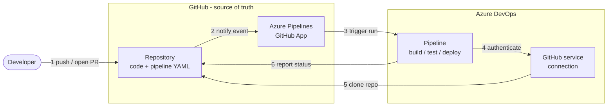

# Run an Azure DevOps pipeline for a GitHub repository

Run an Azure DevOps pipeline against a repository whose code and pipeline YAML stay in GitHub. Azure DevOps only runs the pipeline — no code or YAML is copied into it. Pipelines are created with the `New-GitHubPipeline.ps1` script (`infra/scripts/devops/`) so onboarding is repeatable across repositories.

## How it works

The **Azure Pipelines GitHub App** (GitHub side) and the **GitHub service connection** (Azure DevOps side) are the two halves of the trust link between the platforms. GitHub remains the source of truth; Azure DevOps stores only a pointer to the repo plus the credential to reach it.



### Components

| Component | Lives in | What it does |
|-----------|----------|--------------|
| Repository (code + YAML) | GitHub | Source of truth. Holds the code and the pipeline YAML files. |
| Azure Pipelines GitHub App | GitHub | Connects GitHub to Azure DevOps and forwards events (push, PR, schedule). Installed once. |
| GitHub service connection (`github.com_<owner>`) | Azure DevOps | The credential the pipeline authenticates through to reach GitHub. Created automatically by the app. |
| Pipeline | Azure DevOps | Points at a YAML file in GitHub, then clones the repo and runs build / test / deploy. |

### Run sequence

1. A developer pushes a commit or opens a PR in the GitHub repository.
2. GitHub notifies the Azure Pipelines GitHub App of the push or pull request.
3. The app triggers the matching pipeline in Azure DevOps. Which event fires depends on the YAML `trigger` / `pr` / `schedules`.
4. The pipeline authenticates through the GitHub service connection, which holds the app credential.
5. Using that credential, the agent clones the repository and reads the YAML.
6. The pipeline reports build status back to GitHub as a commit or PR check.

## Before you start

Confirm these roles. Sources are official Microsoft Learn and GitHub docs (see [References](#references)).

| Task | Where | Role / permission required |
|------|-------|----------------------------|
| Install the Azure Pipelines app | GitHub | Organization owner (org-wide install) or repository admin (single repo) |
| Create / view the service connection | Azure DevOps | Endpoint Administrator on the connection, or member of Project Administrators (created automatically by the app install) |
| Use the service connection in a pipeline | Azure DevOps | User role on the service connection |
| Create the pipeline | Azure DevOps | Create build pipeline = Allow — granted to Contributors, Build Administrators, or Project Administrators. Requires Basic access level (not Stakeholder) |

> **Note:** A Project Administrator in Azure DevOps who is also a GitHub organization owner (or repo admin) has everything needed for the full flow.

## Setup flow

### 1. Configure the Azure Pipelines app in GitHub

One-time setup that connects your GitHub account or org to Azure DevOps. Requires GitHub organization owner or repository admin.

1. Install the app. Open <https://github.com/apps/azure-pipelines> and select **Install it for free** (free for public and private repos).
2. Choose repository access. Pick **All repositories** or **Only select repositories**, then **Save**. The app receives read/write access to checks, code, commit statuses, deployments, issues, and pull requests.
3. Link it to Azure DevOps. Select your organization and project, then **Continue**.
4. Authorize. Select **Authorize** to let *Azure Pipelines by Microsoft* access your GitHub account.

This creates a GitHub service connection named `github.com_<owner>` (for example `github.com_Pavan-Microsoft`). The script uses this connection to reach the repo. View it under **Project settings → Service connections**:

```text
https://dev.azure.com/<org>/<project>/_settings/adminservices
```

### 2. Create the pipeline

Create each pipeline with `New-GitHubPipeline.ps1`, which points Azure DevOps at a YAML file that already lives in GitHub. Requires the Create build pipeline permission plus the User role on the service connection.

From the repository root, sign in and move to the script folder:

```powershell
az login --allow-no-subscriptions
az extension add --name azure-devops
cd infra\scripts\devops
```

> **Note:** The `az login` subscription prompt is expected — press **Enter**. The subscription does not affect Azure DevOps commands.

Preview first with `-WhatIf` to confirm values without creating anything:

```powershell
.\New-GitHubPipeline.ps1 `
    -OrgUrl "https://dev.azure.com/<org>" `
    -Project "<project>" `
    -Repo "<owner>/<repo>" `
    -ServiceConnection "github.com_<owner>" `
    -WhatIf
```

A repository usually has more than one pipeline (for example CI and deploy), so run the script once per YAML file. Align each pipeline name with the repo and the YAML purpose — `<repo>-<purpose>`:

| YAML file | Pipeline name |
|-----------|---------------|
| `.azuredevops/pipelines/azure-pipelines-bicep-ci.yml` | `<repo>-bicep-ci` |
| `.azuredevops/pipelines/azure-pipelines-bicep-deploy.yml` | `<repo>-bicep-deploy` |

Create the CI pipeline:

```powershell
.\New-GitHubPipeline.ps1 `
    -OrgUrl "https://dev.azure.com/<org>" `
    -Project "<project>" `
    -Repo "<owner>/<repo>" `
    -ServiceConnection "github.com_<owner>" `
    -PipelineName "<repo>-bicep-ci" `
    -YmlPath ".azuredevops/pipelines/azure-pipelines-bicep-ci.yml"
```

Create the deploy pipeline:

```powershell
.\New-GitHubPipeline.ps1 `
    -OrgUrl "https://dev.azure.com/<org>" `
    -Project "<project>" `
    -Repo "<owner>/<repo>" `
    -ServiceConnection "github.com_<owner>" `
    -PipelineName "<repo>-bicep-deploy" `
    -YmlPath ".azuredevops/pipelines/azure-pipelines-bicep-deploy.yml"
```

> **Note:** If you omit `-PipelineName`, the script defaults to `<owner>-<repo>-CI`. When a repo has multiple pipelines, always pass `-PipelineName` so each one is uniquely named. The script is idempotent — re-running it skips a pipeline that already exists.

### 3. Verify the run

Open **Azure DevOps → Pipelines** to see the new pipeline and its runs:

```text
https://dev.azure.com/<org>/<project>/_build?view=folders
```

- **Pipelines → Recent** shows the pipeline created by the script.
- Open the pipeline and check **Runs** for a successful build triggered from the GitHub commit.

## Pipeline triggers

When a pipeline runs is controlled by the `trigger` / `pr` / `schedules` keywords in the YAML file, not by the creation script. Because the YAML lives in GitHub, the Azure Pipelines GitHub App forwards the matching events to Azure DevOps.

| Trigger type | YAML keyword | Fires when |
|--------------|--------------|------------|
| Continuous integration (push / merge) | `trigger` | A commit is pushed to a listed branch, including when a PR is merged into it (for example `main`) |
| Pull request validation | `pr` | A PR is raised or updated against a listed target branch |
| Scheduled | `schedules` (cron) | On a time schedule (for example nightly), regardless of commits |
| Manual / on-demand | Run button, or `az pipelines run` | You start it manually from the UI or CLI |

Example header in a YAML file:

```yaml
# CI: run when code is pushed/merged to main or dev
trigger:
  branches:
    include: [ main, dev ]

# PR validation: run when a PR targets main
pr:
  branches:
    include: [ main, dev ]

# Scheduled: nightly build at 02:00 UTC on main
schedules:
  - cron: "0 2 * * *"
    displayName: Nightly build
    branches:
      include: [ main ]
    always: true
```

> **Note:** For GitHub-hosted repos, CI and PR events are delivered through the Azure Pipelines GitHub App. Branch policies configured on the GitHub side determine whether a PR run must pass before merging.

## Troubleshooting

| Symptom | Fix |
|---------|-----|
| Cannot install the GitHub app | You need GitHub org owner or repo admin. Ask an owner to install it, or install for a single repo you admin. |
| `Could not find a service connection` | Sign in first: `az login --allow-no-subscriptions`, then re-run. |
| `running scripts is disabled on this system` | `Set-ExecutionPolicy -Scope Process -ExecutionPolicy Bypass` |
| Repository not accessible | Confirm the Azure Pipelines app is installed on that repo (step 1). |
| YAML not found | Ensure the YAML file exists on the branch, or pass `-YmlPath` / `-Branch`. |

## References

Official documentation:

- [Build GitHub repositories with Azure Pipelines](https://learn.microsoft.com/en-us/azure/devops/pipelines/repos/github?view=azure-devops) — GitHub App auth; install requires org owner or repo admin.
- [Pipeline triggers](https://learn.microsoft.com/en-us/azure/devops/pipelines/build/triggers?view=azure-devops) — CI `trigger`, PR `pr`, scheduled `schedules`.
- [Set pipeline permissions](https://learn.microsoft.com/en-us/azure/devops/pipelines/policies/set-permissions?view=azure-devops) — Create build pipeline.
- [About pipeline security roles](https://learn.microsoft.com/en-us/azure/devops/organizations/security/about-security-roles?view=azure-devops)
- [Service connections — security and roles](https://learn.microsoft.com/en-us/azure/devops/pipelines/library/service-endpoints?view=azure-devops#secure-a-service-connection)
- [Permissions and access levels reference](https://learn.microsoft.com/en-us/azure/devops/organizations/security/permissions?view=azure-devops)
- [Installing GitHub Apps](https://docs.github.com/en/apps/using-github-apps/installing-your-own-github-app)
- [`az pipelines create`](https://learn.microsoft.com/en-us/cli/azure/pipelines#az-pipelines-create)

Quick links:

- Script: `infra/scripts/devops/New-GitHubPipeline.ps1`
- Azure Pipelines GitHub App: <https://github.com/apps/azure-pipelines>
- Azure Pipelines app for GitHub Proxima (Enterprise Cloud with data residency): `https://<enterprise-slug>.ghe.com/apps/external-app/azure-pipelines`
